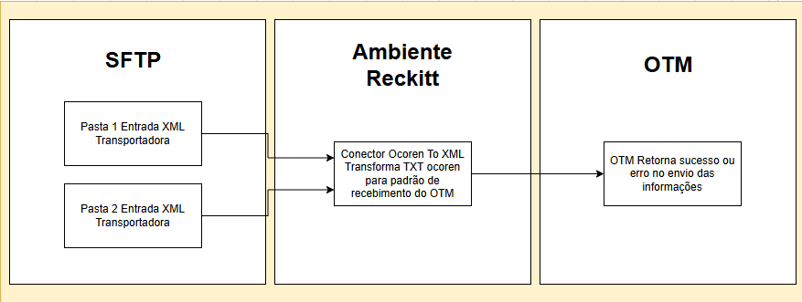

# Conector Ocoren To XML

Conector Reckitt com finalidade de receber arquivos txt no formato ocoren das transportadoras via SFTP e transformar para layout OTM enviando-o após o processo. 

## Fluxo

## Funcionamento

1. - O conector lê duas pastas do SFTP.
2. - Caso tenha arquivo txt, é extraído do arquivo, conforme a posição usando substring, as informações necessárias para envio ao OTM para preencher o [XmlTemplateSaida.xml](desenv/XmlTemplateSaida.xml).
3. - Para extração do "xidStatusCode" é usado a [PlanilhaDeParaCódigos.xlsx](desenv/PlanilhaDeParaC%C3%B3digos.xlsx) traduzindo o código ocoren para OTM.
4. - É feito o envio do XML OTM.

## Documentação

- Planilha DExPARA códigos campo xidStatusCode: [PlanilhaDeParaCódigos.xlsx](desenv/PlanilhaDeParaC%C3%B3digos.xlsx)
- Manual ocoren com todos campos contídos no txt: [OcorenManual.pdf](desenv/OcorenManual.pdf)

## Arquivos Úteis

### Templates

- Txt enviado pelas transportadoras: [OCO_RECKITT_17092024_151811.txt](desenv/OCO_RECKITT_17092024_151811.txt)
- Xml gerado após transformação de todos os campos: [XmlTemplateSaida.xml](desenv/XmlTemplateSaida.xml)

## Requisitos

- Java 21+
